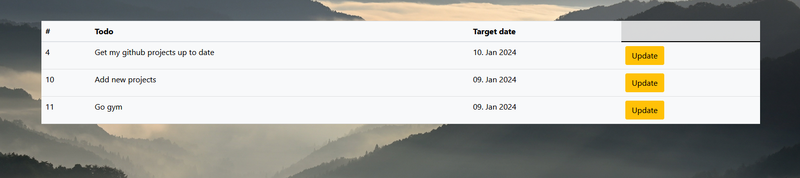
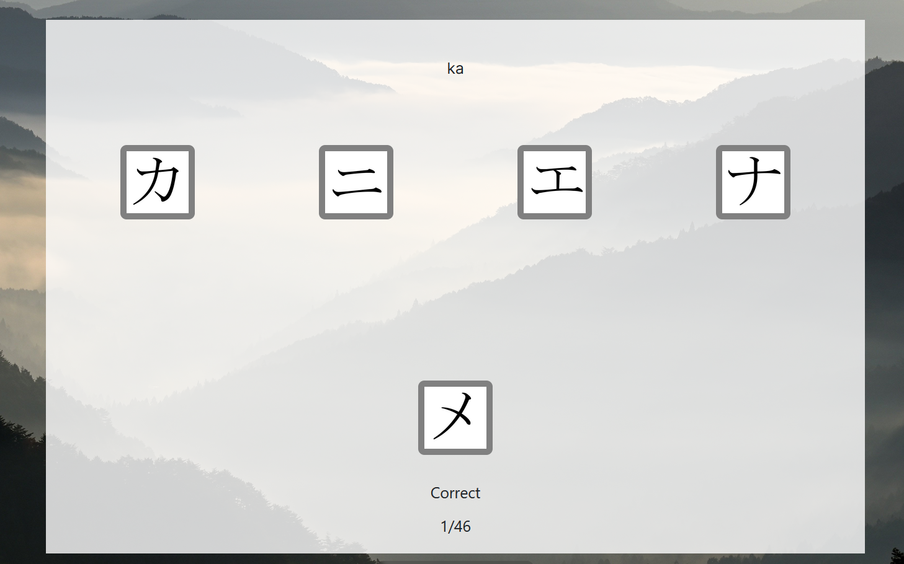

# Personal Homepage
This project is an exercise in webdevelopment.
This project only contains the frontend made in angular. The backend made with spring boot is a separate project.
Bootstrap was used to design elements like buttons or tables.
It has a few randomly put together functionalities.

## Tabs
To navigate through the page I added tabs with specific icons for each page.

## Bookmarks
It is possible to save bookmarks of your favourite webpages. They can also be deleted later on.

## Todos
Add items to the todo list. A description and a target date can be added. These can be edited afterward.

## Twitter List
This part of the project no longer works since twitter removed the option to read posts from their API in the free tier.

I did want to use Twitter, but it did contain too much information I was not interested in.
I only wanted to see the posts of the people I follow and not what they liked or retweeted.
I added everyone I follow to a Twitter-List. This list was then requested over the API and filtered. Retweets and likes were removed.
The remaining posts were saved in a database, but only their id. A library was later used to display the posts.
I could only display 10 posts at a time because the loading times were too long if the amount of posts exceeded this amount.
Pagination was added to display posts beyond the first 10. Each page displays 10 posts as well.

## Japanese Trainer
At the time that I was working on this project I was taking a course in japanese.
I added a trainer to practice the hiragana and katakana alphabets and the vocabulary.

